# AI-Powered Meeting Assistant

A comprehensive, full-stack AI meeting assistant that joins Microsoft Teams calls, analyzes conversations in real-time, and helps meeting organizers guide meetings toward clear, actionable outcomes.

## 🚀 Features

### Core Capabilities
- **Real-time Meeting Analysis**: Joins Teams calls and processes audio streams for live transcript analysis
- **AI-Powered Suggestions**: Provides direct, actionable prompts to meeting organizers via a private web dashboard
- **Specialized Modules**: 
  - Ambiguity Identifier: Detects vague statements and missing specifics
  - Goal Tracker: Monitors agenda adherence and topic drift
  - Action Item Extractor: Identifies tasks, assignees, and deadlines
  - Specificity Proposer: Suggests stronger, more actionable language
  - Finalization Recommender: Guides meeting conclusion and verification

### Web Dashboard
- **Multi-window Interface**: Clean, organized layout with separate panels for agenda, suggestions, and decisions
- **Real-time Updates**: Live suggestions and meeting state via WebSocket
- **Export Capabilities**: Generate meeting summaries in PDF, Word, or text formats
- **Accessibility**: Color-blind friendly design with high contrast support

### Post-Meeting Summary
- **Comprehensive Reports**: Structured documents with decisions, action items, and next steps
- **AI-Generated Content**: Intelligent summarization using GitHub Models
- **Multiple Formats**: Export in various formats for different use cases

## 🏗️ Architecture

### System Architecture Diagram

```mermaid
graph TB
    %% User Interface Layer
    subgraph "🖥️ Frontend Layer"
        Dashboard[Meeting Dashboard<br/>Web Interface<br/>Port 3978]
        Teams[Microsoft Teams<br/>Bot Interface]
    end
    
    %% API Gateway & Bot Framework
    subgraph "🌐 API Layer"
        Express[Express.js Server<br/>Port 3978]
        BotFramework[Bot Framework<br/>Teams Integration]
        WebSocket[WebSocket Server<br/>Real-time Updates]
    end
    
    %% Core Application Logic
    subgraph "🧠 AI Agent Layer"
        Orchestrator[Main LLM Orchestrator<br/>GitHub Models]
        Ambiguity[Ambiguity Identifier<br/>Module]
        GoalTracker[Goal Tracker<br/>Module]
        ActionExtractor[Action Item Extractor<br/>Module]
        Specificity[Specificity Proposer<br/>Module]
        Finalization[Finalization Recommender<br/>Module]
    end
    
    %% Meeting State Management
    subgraph "📊 State Management"
        MeetingState[Meeting State<br/>In-Memory Storage]
        Transcript[Live Transcript<br/>Processing]
        Suggestions[AI Suggestions<br/>Queue]
    end
    
    %% Data Storage
    subgraph "💾 Data Layer"
        Memory[Memory Storage<br/>Bot Framework]
        MeetingData[Meeting Data<br/>Decisions & Actions]
    end
    
    %% External Services
    subgraph "☁️ External Services"
        GitHub[GitHub Models<br/>GPT-4.1-nano]
        AzureSpeech[Azure Speech Service<br/>Real-time STT]
        GraphAPI[Microsoft Graph API<br/>Teams Integration]
    end
    
    %% Azure Cloud Services
    subgraph "☁️ Azure Cloud (Production)"
        AppService[Azure App Service<br/>Hosting]
        BotService[Azure Bot Service<br/>Registration]
        SpeechService[Azure Speech Service<br/>Audio Processing]
        KeyVault[Azure Key Vault<br/>Secrets Management]
    end
    
    %% User Interactions
    Dashboard --> Express
    Teams --> BotFramework
    BotFramework --> Express
    
    %% API to Application
    Express --> Orchestrator
    Express --> WebSocket
    WebSocket --> Dashboard
    
    %% AI Agent Processing Flow
    Orchestrator --> Ambiguity
    Orchestrator --> GoalTracker
    Orchestrator --> ActionExtractor
    Orchestrator --> Specificity
    Orchestrator --> Finalization
    
    %% State Management
    Orchestrator --> MeetingState
    MeetingState --> Transcript
    MeetingState --> Suggestions
    Suggestions --> WebSocket
    
    %% Data Persistence
    MeetingState --> Memory
    MeetingState --> MeetingData
    
    %% External API Calls
    Orchestrator --> GitHub
    BotFramework --> GraphAPI
    
    %% Azure Production Flow
    Express -.-> AppService
    BotFramework -.-> BotService
    GitHub -.-> KeyVault
    AzureSpeech -.-> SpeechService
    
    %% Styling
    classDef frontend fill:#e1f5fe,stroke:#01579b,stroke-width:2px
    classDef api fill:#f3e5f5,stroke:#4a148c,stroke-width:2px
    classDef ai fill:#e8f5e8,stroke:#1b5e20,stroke-width:2px
    classDef state fill:#fff3e0,stroke:#e65100,stroke-width:2px
    classDef data fill:#fce4ec,stroke:#880e4f,stroke-width:2px
    classDef external fill:#f1f8e9,stroke:#33691e,stroke-width:2px
    classDef azure fill:#e3f2fd,stroke:#0277bd,stroke-width:2px
    
    class Dashboard,Teams frontend
    class Express,BotFramework,WebSocket api
    class Orchestrator,Ambiguity,GoalTracker,ActionExtractor,Specificity,Finalization ai
    class MeetingState,Transcript,Suggestions state
    class Memory,MeetingData data
    class GitHub,AzureSpeech,GraphAPI external
    class AppService,BotService,SpeechService,KeyVault azure
```



**Architecture Flow:**

1. **Frontend Layer**: 
   - Web dashboard for meeting organizers (real-time interface)
   - Microsoft Teams bot for meeting participants

2. **API Layer**: 
   - Express.js server handles HTTP requests and WebSocket connections
   - Bot Framework integration for Teams communication

3. **AI Agent Layer**: 
   - Main LLM orchestrator coordinates specialized modules
   - Each module handles specific meeting analysis tasks

4. **State Management**: 
   - Real-time meeting state tracking
   - Live transcript processing and AI suggestion generation

5. **Data Layer**: 
   - In-memory storage for active meetings
   - Persistent storage for meeting decisions and action items

6. **External Services**: 
   - GitHub Models for AI processing
   - Azure Speech Service for audio processing
   - Microsoft Graph API for Teams integration

7. **Azure Cloud (Production)**: 
   - Scalable hosting on Azure App Service
   - Secure secret management with Key Vault
   - Enterprise-grade bot registration and audio processing

### Local Development vs Production

**🖥️ Local Development:**
- Runs on `localhost:3978`
- Uses local environment variables
- Direct GitHub Models API calls
- In-memory meeting state
- WebSocket for real-time updates

**☁️ Azure Production:**
- Hosted on Azure App Service
- Secure secret management with Key Vault
- Azure Bot Service registration
- Azure Speech Service for audio processing
- Scalable and enterprise-ready

### Agent-Based Design
- **Main Orchestrator**: Single LLM agent coordinates specialized modules
- **Modular Components**: Each module handles specific meeting analysis tasks
- **Real-time Processing**: Live transcript analysis and suggestion generation

### Technology Stack
- **Backend**: Node.js with TypeScript, Express, WebSocket
- **AI/LLM**: GitHub Models (GPT-4.1-nano)
- **Frontend**: Vanilla JavaScript with modern CSS
- **Teams Integration**: Microsoft 365 Agents SDK
- **Audio Processing**: Azure Speech Services (planned)

## 🚀 Quick Start

### Prerequisites
- [Node.js](https://nodejs.org/) 18, 20, or 22
- [Microsoft 365 Agents Toolkit](https://aka.ms/teams-toolkit)
- GitHub account with access to [GitHub Models](https://models.github.ai/)
- Azure account for Teams integration and audio processing

### Installation

1. **Clone and Install Dependencies**
   ```bash
   git clone <repository-url>
   cd intelligent_assistant
   npm install
   ```

2. **Configure Environment Variables**
   ```bash
   # Add your GitHub token to the existing environment file
   echo "SECRET_GITHUB_TOKEN=your_github_token_here" >> env/.env.local.user
   ```

3. **Start Development Server**
   ```bash
   npm run dev:teamsfx
   ```

4. **Access Web Dashboard**
   - Open http://localhost:3978 in your browser
   - The dashboard will connect to the meeting assistant via WebSocket

### Teams Integration

1. **Configure Bot Permissions**
   - Follow the [Azure Setup Guide](AZURE_SETUP.md) to configure required permissions
   - Enable `Calls.AccessMedia.Chat` permission for audio access

2. **Deploy to Azure**
   ```bash
   npm run build
   # Deploy using Teams Toolkit or Azure CLI
   ```

3. **Test in Teams**
   - Add the bot to a Teams meeting
   - The bot will join and start analyzing the conversation
   - Open the web dashboard to see real-time suggestions

## 📊 Web Dashboard

### Main Panels

#### Agenda Panel (Left)
- Displays meeting agenda with current topic highlighting
- Real-time progress tracking
- Add/modify agenda items during the meeting

#### Live Suggestions Panel (Center)
- Real-time AI suggestions for the meeting organizer
- Filter by suggestion type (ambiguity, goals, actions, etc.)
- Priority-based color coding
- Acknowledge suggestions to track progress

#### Decisions & Actions Panel (Right)
- Tracks all meeting decisions
- Manages action items with assignees and deadlines
- Export capabilities for post-meeting summaries

### Features
- **Real-time Updates**: WebSocket connection for live data
- **Responsive Design**: Works on desktop and mobile devices
- **Accessibility**: High contrast mode and screen reader support
- **Export Options**: PDF, Word, and text format summaries

## 🤖 AI Modules

### Ambiguity Identifier
Detects vague statements and suggests clarifications:
- Identifies missing assignees, deadlines, or specifics
- Flags weak action verbs
- Suggests clarifying questions

### Goal Tracker
Monitors meeting focus and agenda adherence:
- Detects topic drift
- Tracks agenda item timing
- Suggests when to move to next topic

### Action Item Extractor
Identifies and structures action items:
- Extracts tasks from conversation
- Identifies assignees and deadlines
- Categorizes by priority

### Specificity Proposer
Improves task clarity and actionability:
- Suggests stronger action verbs
- Identifies missing success criteria
- Proposes specific deadlines and resources

### Finalization Recommender
Guides meeting conclusion:
- Suggests verification of decisions
- Identifies incomplete agenda items
- Proposes next steps and follow-ups

## 🔧 Configuration

### Environment Variables

```bash
# GitHub Models
GITHUB_TOKEN=your_github_token

# Bot Framework (for Teams integration)
BOT_ID=your_bot_app_id
SECRET_BOT_PASSWORD=your_bot_client_secret

# Azure Speech Service (for audio processing)
AZURE_SPEECH_KEY=your_speech_service_key
AZURE_SPEECH_REGION=your_speech_service_region

# Microsoft Graph (for Teams API)
GRAPH_TENANT_ID=your_tenant_id
GRAPH_CLIENT_ID=your_graph_app_id
GRAPH_CLIENT_SECRET=your_graph_client_secret
```

### Teams App Manifest

Update `appPackage/manifest.json` with required permissions:

```json
{
  "permissions": [
    "identity",
    "messageTeamMembers"
  ],
  "webApplicationInfo": {
    "id": "your-bot-app-id",
    "resource": "https://RscBasedStoreApp"
  }
}
```

## 📚 API Reference

### WebSocket Events

#### Client → Server
- `get_meeting_state`: Request current meeting state
- `acknowledge_suggestion`: Mark suggestion as acknowledged
- `set_agenda_item`: Change current agenda item

#### Server → Client
- `meeting_state`: Meeting state update
- `suggestion`: New AI suggestion
- `decision`: New decision recorded
- `action_item`: New action item identified

### REST Endpoints

- `GET /api/meeting-state`: Get current meeting state
- `GET /api/meeting-summary`: Generate meeting summary
- `POST /api/messages`: Bot Framework webhook

## 🚀 Deployment

### Local Development
```bash
npm run dev:teamsfx
```

### Production Deployment
```bash
npm run build
npm start
```

### Azure Deployment
1. Follow [Azure Setup Guide](AZURE_SETUP.md)
2. Configure required Azure resources
3. Deploy using Teams Toolkit or Azure CLI

## 🔍 Monitoring

### Application Insights
- Bot performance metrics
- WebSocket connection monitoring
- Error tracking and alerting

### Logging
- Structured logging for all activities
- Meeting analytics and insights
- Debug information for troubleshooting

## 🔮 Roadmap

### Planned Features
- [ ] Real-time audio processing with Azure Speech Services
- [ ] Advanced meeting analytics and insights
- [ ] Integration with calendar systems
- [ ] Multi-language support
- [ ] Mobile app for meeting organizers
- [ ] Integration with project management tools

### Known Limitations
- Audio processing requires Azure Speech Services setup
- Teams calling permissions need admin approval
- WebSocket connections may need firewall configuration

## What's included in the template

| Folder       | Contents                                            |
| - | - |
| `.vscode`    | VSCode files for debugging                          |
| `appPackage` | Templates for the application manifest        |
| `env`        | Environment files                                   |
| `infra`      | Templates for provisioning Azure resources          |
| `src`        | The source code for the application                 |

The following files can be customized and demonstrate an example implementation to get you started.

| File                                 | Contents                                           |
| - | - |
|`src/index.ts`| Sets up the agent server.|
|`src/adapter.ts`| Sets up the agent adapter.|
|`src/config.ts`| Defines the environment variables.|
|`src/agent.ts`| Handles business logics for the Basic Custom Engine Agent.|

The following are Microsoft 365 Agents Toolkit specific project files. You can [visit a complete guide on Github](https://github.com/OfficeDev/TeamsFx/wiki/Teams-Toolkit-Visual-Studio-Code-v5-Guide#overview) to understand how Microsoft 365 Agents Toolkit works.

| File                                 | Contents                                           |
| - | - |
|`m365agents.yml`|This is the main Microsoft 365 Agents Toolkit project file. The project file defines two primary things:  Properties and configuration Stage definitions. |
|`m365agents.local.yml`|This overrides `m365agents.yml` with actions that enable local execution and debugging.|
|`m365agents.playground.yml`| This overrides `m365agents.yml` with actions that enable local execution and debugging in Microsoft 365 Agents Playground.|

## Additional information and references

- [Microsoft 365 Agents Toolkit Documentations](https://docs.microsoft.com/microsoftteams/platform/toolkit/teams-toolkit-fundamentals)
- [Microsoft 365 Agents Toolkit CLI](https://aka.ms/teamsfx-toolkit-cli)
- [Microsoft 365 Agents Toolkit Samples](https://github.com/OfficeDev/TeamsFx-Samples)

## Known issue
- The agent is currently not working in any Teams group chats or Teams channels when the stream response is enabled.
